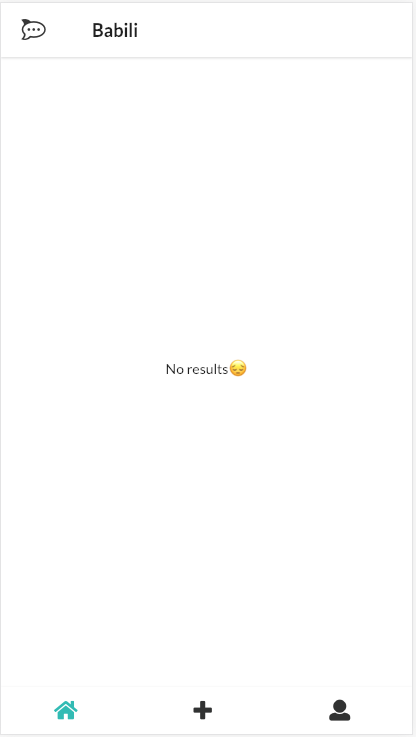
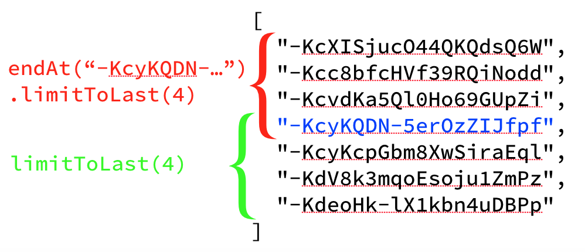

# Unit 10

As a last step to have a functional application we need to retrieve memes from the database and show them in the timeline. Remember we have two timelines: the global timeline in the home section where a logged user can see all the memes posted by all users and, the personal timeline in the profile section where user can see all the memes posted by him/her.

## Steps

### Finish sections for Home and Profile

Right know we have a working `Add` section under the `/add` url, in addition to the login and signup screens, but we need to have a real home and profile screens.

#### Home section

Start updating the `containers/Home.js` file. The `render` methods will look like:

```javascript
  render() {
    const { data, fetching, error } = this.props;

    return (
      <Layout section={urls.HOME}>
        <AppBar />

        <Timeline
          data={data}
          loading={fetching}
          error={error && error.message}
          onScroll={this.handleScroll}
        />
      </Layout>
    );
  }
```

The `Layout` component (really it is a container) will occupy the whole screen and optionally will draw the bottom `NavigationBar` component. The `AppBar` component is used to show the top application bar with the logo and title of the section. Finally the `Timeline` component will fill the rest of the space and will show the memes.



We need to load memes when the component is mounted but also when the user scrolls the timeline and arrives at the end. The idea is also to load memes incrementally, for example in chunks of 10 memes. The `Timeline` component has an `onScroll` property that will be invoked each time the timeline arrives at the end. This will allow us to know when we need to load more memes.

```javascript
// Debounce the action to load memes to avoid triggering tons of requests
  requestSparks = debounce(
    () => {}, // This is the function that will load the memes
    250,
  ).bind(this);

  componentDidMount() {
    // Load memes when the component is mounted
    this.requestSparks();
  }

  handleScroll = () => {
    const { data } = this.props;
    const size = data.length;
    const lastKey = size && data[size - 1].key;

    // Load memes when we reach the bottom of the timeline
    this.requestSparks(lastKey);
  }
```

Note how we debounce the invocation to the function that will request for memes to avoid triggering tons of actions.

#### Profile section

Lets create a `containers/Profile.js` file. The code will be very similar to the `Home` section. We make use of the `Layout`, `AppBar` and `Timeline` but also introduce the `ProfileSummary` component that will show some info about the user and let us the option to logout from the application.

```javascript
  render() {
    const {
      user, data, fetching, error,
    } = this.props;

    return (
      <Layout section={urls.PROFILE}>
        <AppBar title="Profile" />

        <ProfileSummary
          userInfo={user}
          onLogout={this.handleLogout}
        />

        <TimelineWrapper>
          <Timeline
            data={data}
            loading={fetching}
            error={error && error.message}
            onScroll={this.handleScroll}
          />
        </TimelineWrapper>
      </Layout>
    );
  }
```


Update the `containers/App.js` file to import the `Profile` component and add it to the known routes:

```javascript
...
import Profile from './Profile';
...
  render() {
    const { user } = this.props;
    ...
    // If user is logged in setup the different routes
    return (
      <Router>
        <Switch>
          <Route exact path={urls.HOME} component={Home} />
          <Route exact path={urls.ADD} component={Add} />
          <Route exact path={urls.PROFILE} component={Profile} />
          <Route path={urls.LOGIN} component={LoginForm} />
          <Route path={urls.SIGNUP} component={SignupForm} />
          <Route component={NotFound} />
        </Switch>
      </Router>
    );
  }
```

For the logout we invoke the `logout` action (that will make a signout of the user in Firebase Authentication) and push the home url in the browser history:

```javascript
  handleLogout = () => {
    const { logout, history } = this.props;
    logout();
    history.push(urls.HOME);
  }
```

> NOTE: The `Profile` component receives the `history` property because it is a child of the `Route` component used in the `App.js`. In any other case, if you desire to access the history or react-router info in a component you need to wrap it with the HOC `withRouter`

### Create actions, sagas and reducers to load memes

Add the next constants to the  `ducks/data/types.js`:

```javascript
export const LOAD_SPARKS_REQUEST = 'sparks/load/request';
export const LOAD_SPARKS_START = 'sparks/load/start';
export const LOAD_SPARKS_SUCCESS = 'sparks/load/success';
export const LOAD_SPARKS_FAILED = 'sparks/load/failed';
```

Add the actions needed for the *load sparks* action. Note the `loadSparksRequest` action pass two parameters: a user `uid`, to indicate we want to load memes from a given user instead everybody, and the `lastKey` of the last meme loaded so we can continue loading another chunk of memes from there.

```javascript
export const loadSparksRequest = ({ uid, lastKey }) => ({
  type: types.LOAD_SPARKS_REQUEST,
  payload: {
    uid,
    lastKey,
  },
});
export const loadSparksStart = clear => ({
  type: types.LOAD_SPARKS_START,
  payload: {
    clear,
  },
});
export const loadSparksSuccess = sparks => ({
  type: types.LOAD_SPARKS_SUCCESS,
  payload: {
    sparks,
  },
});
export const loadSparksFailed = error => ({
  type: types.LOAD_SPARKS_FAILED,
  payload: {
    error,
  },
});
```

Update the `ducks/data/sagas.js` file yo listen for the *request* action. As you can see the `loadSparks` sagas simply triggers the appropriate actions and all the logic to access data is in the `DataService.loadSparks` method.

> We will see the implementation of `DataService.loadSparks` in the next section.

```javascript
...

function* loadSparks(action) {
  const { uid, lastKey } = action.payload;

  yield put(actions.loadSparksStart(!lastKey));

  try {
    const sparks = yield call(DataService.loadSparks, { uid, lastKey });
    yield put(actions.loadSparksSuccess(sparks));
  } catch (error) {
    yield put(actions.loadSparksFailed(error));
  }
}

export default function* () {
  yield all([
    yield takeLatest(types.POST_SPARK_REQUEST, postSpark),
    yield takeLatest(types.LOAD_SPARKS_REQUEST, loadSparks),
  ]);
}
```

Finally, we need to update our `ducks/data/reducer.js` to manage the load start, success and failure actions. The main part is the `success` action where we need to concatenate the current loaded memes with the new ones loaded by the action:

```javascript
export default function (state = defaultState, action) {
  switch (action.type) {
    ...
    case types.LOAD_SPARKS_START: {
      return {
        ...state,
        fetching: true,
        error: null,
        data: action.payload.clear ? [] : [...state.data],
      };
    }

    case types.LOAD_SPARKS_SUCCESS: {
      return {
        ...state,
        data: [...state.data].concat(action.payload.sparks),
        fetching: false,
        error: null,
      };
    }

    case types.POST_SPARK_FAILED:
    case types.LOAD_SPARKS_FAILED: {
      return {
        ...state,
        fetching: false,
        error: action.payload.error,
      };
    }

    default:
      return state;
  }
}
```

### Querying memes in Firebase RealTime Database

The code needed to retrive memes from Friebase is located under `DataService.loadSparks`. As we said it recevies two parameters:

- `uid`, if provided it means we only need to retrive memes posted by this user, that is, we are retrieving the memes from the user timeline. Otherwise we will query all the memes no matter the user posted them.
- `lastKey`, if provided is the key of the last meme read and that means we need to continue reading from there.

```javascript
  /**
   * Load sparks. If user is provided it loads the user's feed sparks.
   */
  loadSparks = async ({ uid = null, lastKey = null } = {}) => {
    let sparks;

    if (!uid) {
      sparks = await loadSparksFromAllUsers(lastKey);
    } else {
      sparks = await loadSparksFromUserFeed(uid, lastKey);
    }

    // Update each spark with author display name
    const updatedSparks = await Promise.all(sparks.map(async (sparkData) => {
      const userName = await getUserDisplayName(sparkData.author);
      return {
        ...sparkData,
        userName,
      };
    }));

    return updatedSparks;
  };
```

As you can see, first we get the *memes* or the *sparks* and for each of them we get the data from its author attaching to the final data under the `userName` property.

If we were working with HTTP connections you could just screaming `OMG ! For each meme one extra request to get the user's name !`, but that's not the case when working with Firebase. Firebase uses websockets, that means we have an open connection through which we can make tons of requests without suffering performance issues. 

In the code, instead query for each meme author sequentially we are creating an array of promises (each one responsible to query for the author of a meme) and *running all the promises at the time* (note the emphasis in the sentence 😅). 

----

The way to query for memes is implemented in the functions `loadSparksFromAllUsers` and `loadSparksFromUserFeed` and depends on:

- To read memes from all the users:
  1. we need to query at `/sparks` property of the database and then
  2. for each meme, query to get their author name.
- To retrieve the memes of a given user:
  1. we need to first read his/her feed at `/users/{uid}/feed` to get an array or meme ids.
  2. for each id get the meme itseflf
  3. for each meme, query to get their author name.

To load a chunk of memes from a given position Firebase RealTime Database has some nice methods `endAt` and `limitToLast`:



```javascript
  let query;
  if (!lastKey) {
    query = database.ref('sparks/')
      .orderByKey()
      .limitToLast(LIMIT);
  } else {
    query = database.ref('sparks/')
      .orderByKey()
      .endAt(lastKey)
      .limitToLast(LIMIT);
  }
```

> Note, there exists also the counterpart functions `startAt` and `limitToFirst`.

Because we want to query the memes only once we run the query with `query.once('value')`:

```javascript
const snapshot = await query.once('value');
```
