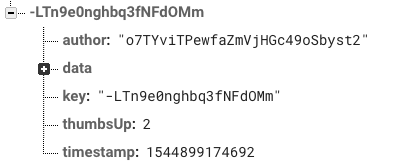

# Unit 11

We have a functional application that allows to register users, login, post memes and see them in a nice timeline.

On this lesson we are going to add a new feature to our app: the possibility to like a meme. For each meme we will show a thumb icon with the number of likes and let users click on it to increase the number.

## Steps

### Structuring data

Because we want to count the number of likes of each meme we will store a  `thumbsUp` counter within each meme. Note, we are going to implement a very basic functionality, so users can like more than once.



### Increasing the tumbsUp counter

The logic that will increase the counter in Firebase will reside in the `DataService.thumbsUp` method. As you can see in the next code, given a meme id we get a reference and increase the counter. To avoid concurrency problems (i.e. two clients reads the value 4 and increase in 1 will result in the value 5 instead 6) we use the `transaction` method. The callback passed to the `transaction` will receive the current value and must return a new one that will be used as the new value.

```javascript
  /**
   * Increase a spark's thumbs up value
   */
  thumbsUp = async (key) => {
    const result = await database.ref(`sparks/${key}`)
      // We update the spark in a transaction operation to avoid concurrency problems.
      // The way to do is "querying" for the spark and updating its properties.
      .transaction((spark) => {
        if (spark) {
          return {
            ...spark,
            key,
            thumbsUp: spark.thumbsUp ? spark.thumbsUp + 1 : 1,
          };
        }
        return spark;
      });

    if (result.committed && result.snapshot.exists()) {
      return result.snapshot.val();
    }
    return null;
  }
```

From Firebase reference doc: ` you pass transaction() an update function which is used to transform the current value into a new value. If another client writes to the location before your new value is successfully written, your update function will be called again with the new current value, and the write will be retried. This will happen repeatedly until your write succeeds without conflict or you abort the transaction by not returning a value from your update function.`

### Create the actions, saga and reducer to like a meme

Add the constanst to the `ducks/data/type.js` file:

```javascript
export const THUMBS_UP_REQUEST = 'sparks/thumbsup/request';
export const THUMBS_UP_START = 'sparks/thumbsup/start';
export const THUMBS_UP_SUCCESS = 'sparks/thumbsup/success';
export const THUMBS_UP_FAILED = 'sparks/thumbsup/failed';
```

Add the corresponding action in the `ducks/data/actions.js` file:

```javascript
export const thumbsUpRequest = key => ({
  type: types.THUMBS_UP_REQUEST,
  payload: {
    key,
  },
});
export const thumbsUpStart = () => ({
  type: types.THUMBS_UP_START,
});
export const thumbsUpSuccess = spark => ({
  type: types.THUMBS_UP_SUCCESS,
  payload: {
    spark,
  },
});
export const thumbsUpFailed = error => ({
  type: types.THUMBS_UP_FAILED,
  payload: {
    error,
  },
});
```

Update the `ducks/data/sagas.js` file to listen for the *request* action and run the needed logic:

```javascript
...

function* thumbsUpSpark(action) {
  const { key } = action.payload;
  yield put(actions.thumbsUpStart(key));

  try {
    const spark = yield call(DataService.thumbsUp, key);
    yield put(actions.thumbsUpSuccess(spark));
  } catch (error) {
    yield put(actions.thumbsUpFailed(error));
  }
}

export default function* () {
  yield all([
    yield takeLatest(types.POST_SPARK_REQUEST, postSpark),
    yield takeLatest(types.LOAD_SPARKS_REQUEST, loadSparks),
    yield takeLatest(types.THUMBS_UP_REQUEST, thumbsUpSpark),
  ]);
}
```

Finally, update the `ducks/data/reducers.js` to handle the start, success and failure actions:

```javascript
...
export default function (state = defaultState, action) {
  switch (action.type) {
    case types.POST_SPARK_START:
    case types.THUMBS_UP_START: {
      return {
        ...state,
        fetching: true,
        error: null,
      };
    }

    ...

    case types.POST_SPARK_FAILED:
    case types.LOAD_SPARKS_FAILED:
    case types.THUMBS_UP_FAILED: {
      return {
        ...state,
        fetching: false,
        error: action.payload.error,
      };
    }

    case types.THUMBS_UP_SUCCESS: {
      const { spark } = action.payload;
      const newData = state.data.map(item => (item.key === spark.key ? spark : item));

      return {
        ...state,
        data: newData,
        fetching: false,
        error: null,
      };
    }

    default:
      return state;
  }
}
```

Finally, to make the thumbsUp working we need to trigger the `thumbsUpRequest` action each time the user clicks in the button. So update the `containers/Home.js` file and add the code:

```javascript
  handleOnThumb = (spark) => {
    const { thumbsUp } = this.props;
    thumbsUp(spark.key);
  }

  render() {
    const { data, fetching, error } = this.props;

    return (
      <Layout section={urls.HOME}>
        <AppBar />

        <Timeline
          data={data}
          loading={fetching}
          error={error && error.message}
          onScroll={this.handleScroll}
          onThumbClick={this.handleOnThumb}
        />
      </Layout>
    );
  }
```

