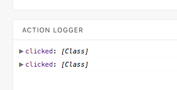
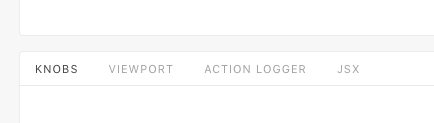
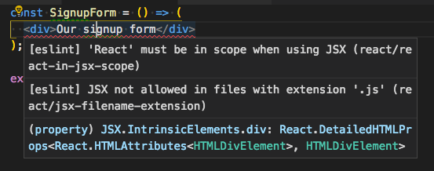
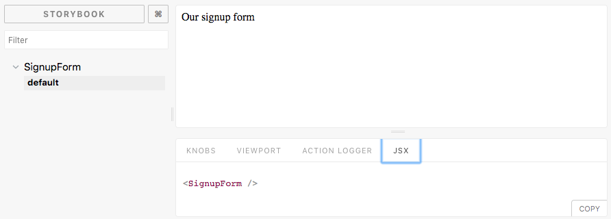
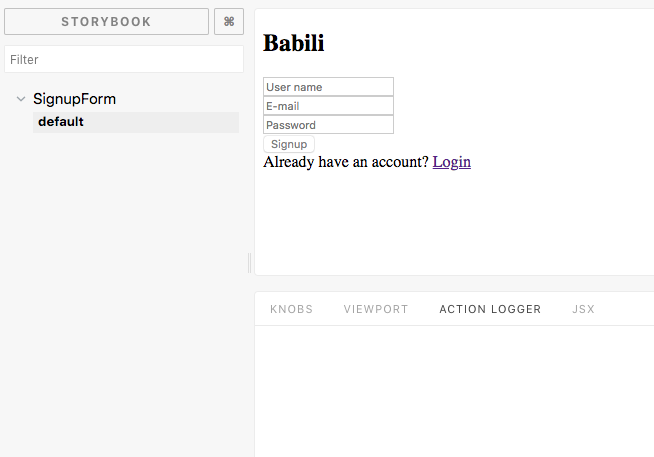
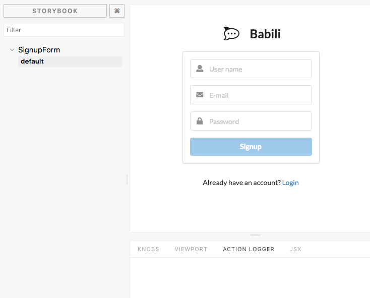
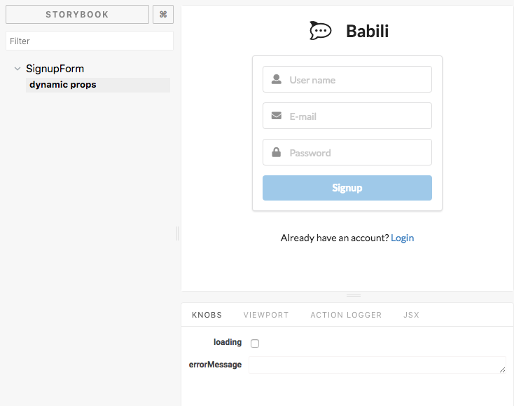

# Unit 2

This unit installs the [storybook.js](https://storybook.js.org) tool and creates the presentational components of the app.

## Steps

### Storybook.js

When developing reusable components (imagine a basic library of buttons, labels, etc) we need to continuously see if the components works as expected, for example, *if I pass the property `disable` to a button it must look disable*, *if I pass the `loading` property to a label it must show a loading spinner*, etc.

`Storybook.js` allow us to write *stories* (use cases) of our components and it will present in a *live* dashboard that is updated if we change our code. Once finished `Storybook.js` also allows to create a *build* of our stories that can server as a documentation/example for those that are going to use our library.

To install storybook:

- `$ npm i -g @storybook/cli` Install it as a global dependency.
- Go into your project folder `$ cd PROJECT_NAME`
- `getstorybook` run initialization script. It automatically detect the project is CRA based and will update our dependencies and add a couple of scripts into the `package.json` file.

Now if we run storybook `$ yarn run storybook` if will run a server at `http://localhost:9009` showing some example stories.

### Storybook.js addons

Storybooks can be configured with addons, which extends its functionalities. We are going to install:

- [knobs](https://github.com/storybooks/storybook/tree/release/3.4/addons/knobs): 
Knobs allow you to edit React props dynamically using the Storybook UI. You can also use Knobs as dynamic variables inside your stories. `$ yarn add @storybook/addon-knobs --dev`.

- [Viewport](): Viewport allows your stories to be displayed in different sizes and layouts in Storybook. This helps build responsive components inside of Storybook. `$ yarn add @storybook/addon-viewport --dev`

- [JSX preview](https://github.com/storybooks/addon-jsx): 
This addon shows a preview of the JSX code for each story. It allows you to configure the display and copy the code with a single click. `$ yarn add --dev storybook-addon-jsx`

Update the `.storybook/addons.js` file to import the new installed addons. It should look similar to:

```javascript
import '@storybook/addon-knobs/register';
import '@storybook/addon-viewport/register';
import '@storybook/addon-actions/register';
import 'storybook-addon-jsx/register';
import '@storybook/addon-links/register';
```

After adding new addons we can the new tabs in the storybook dashboard




### A dummy SignupForm component with an story in Storybook.js

> NOTE: From here I'm supposing you are using, like me, **vscode** editor with **eslint** extension installed.

Lets create a `src/components/SignupForm.js` file with a very basic content:

```javascript
const SignupForm = () => (
  <div>Our signup form</div>
);

export default SignupForm;
```

Automatically, the editor will highlight two error: 

- `[eslint] 'React' must be in scope when using JSX (react/react-in-jsx-scope)`: This can be easily solved import react dependency on top of the file: `import React from 'react';`.
- `[eslint] JSX not allowed in files with extension '.js' (react/jsx-filename-extension)`: This can be solved indicating to the eslint tool that we want to use JSX notation both in `.js`  and `.jsx` files. To do that, edit the `.eslintrc` file and edit as follows:
  ```json
  {
    "extends": "airbnb",
    "rules": {
      "react/jsx-filename-extension": [1, { "extensions": [".js", ".jsx"] }]
    }
  }
  ```

Open the `src/stories/index.js` file and lets update the file to contain a story about our new `SignupForm` component

```javascript
/* eslint-disable import/no-extraneous-dependencies */
import React from 'react';

import { storiesOf, setAddon } from '@storybook/react';
import JSXAddon from 'storybook-addon-jsx';

import SignupForm from '../components/SignupForm';

setAddon(JSXAddon);

storiesOf('SignupForm', module)
  .addWithJSX('default', () => <SignupForm />);
```

> NOTE: The line `/* eslint-disable import/no-extraneous-dependencies */` is necessary to avoid eslint marks the lines related with importing `@storybook` as error. Those packages are set as `devDependencies` in `package.json` and because we are using in a *normal* JS file, eslint advice us that any dependency must reside as `dependency`. That line on the top of the file simply informs eslint that can ignore that issue.

At this points if you run storybook `$ yarn run storybook` the result should show something like:



### Building the SignupForm

> To create a nice UI we are going to make use of:
> 
> - [semantic-ui-react](https://react.semantic-ui.com/usage) (`$ yarn add semantic-ui-react`) and [semantic-ui-css](https://react.semantic-ui.com/usage) (`$ yarn add semantic-ui-css`): Set of components implementing the SemanticUI framework.
> - [styled-componets](https://www.styled-components.com/) (`$ yarn add styled-components`): Use tagged template literals to create styled react components.
>
> In addition, we are going to use:
> 
> - [prop-types](https://github.com/facebook/prop-types) (`$ yarn add prop-types`): Runtime type checking for React props and similar objects.
> - [validator](https://github.com/chriso/validator.js) (`$ yarn add validator`): String validation utils, for example, to validate a string is a well formed email.

Our `SignupForm` has three properties:

- `loading`: Boolean used to indicate if the form is working, like trying to send data to the server. If so the component must show a loading spinner.
- `errorMessagep`: String with a message to show to the user to inform about any error in the form or sending data.
- `onSubmit`: A function to be executed when user fills the form. This allows to separate the logic from the presentation.

```html
  <SignupForm
    loading={loading}
    errorMessage={errorMessage}
    onSubmit={() => console.log('Submit 🚀)}
  />
```

> NOTE: Because we are going to use ES6 experimental features not included yet in `eslint` tool we need to set the property `"parser": "babel-eslint"` in the `.eslintrc` file.

If we run again storybook we will see something similar to the next picture, where the form components has no style. This is due we need to make storybook includes the appropriate CSS styles from *sematinc-ui*.



To fix this simple edit the `./storybook/config.js` file and add the next lines:

```javascript
import { configure } from '@storybook/react';

import 'semantic-ui-css/semantic.min.css';
import '../src/globalStyles';

function loadStories() {
  require('../src/stories');
}

configure(loadStories, module);
```

> NOTE: We have created a `src/globalStyles.js` file which defines some global CSS styles for our app.

Finally, with the previous changes you should see:



Now we can update our component story to use the `knobs` addons that allows us to pass properties dynamically. Update the code at `src/stories/index.js` to the next one:

```javascript
/* eslint-disable import/no-extraneous-dependencies */
import React from 'react';

import { storiesOf, setAddon } from '@storybook/react';
import JSXAddon from 'storybook-addon-jsx';
import { action } from '@storybook/addon-actions';
import { withKnobs, text, boolean } from '@storybook/addon-knobs';

import SignupForm from '../components/SignupForm';

setAddon(JSXAddon);

storiesOf('SignupForm', module)
  .addDecorator(withKnobs)
  .addWithJSX('dynamic props', () => {
    const loading = boolean('loading');
    const errorMessage = text('errorMessage');

    return (
      <SignupForm
        loading={loading}
        errorMessage={errorMessage}
        onSubmit={action('submit')}
      />
    );
  });
```

Now story book will show, in the knobs tab, the two knobs defined for `loading` and `errorMessage`. Try updating its value to see how storybook updates the component:


