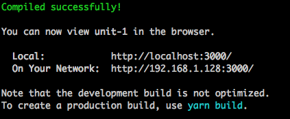
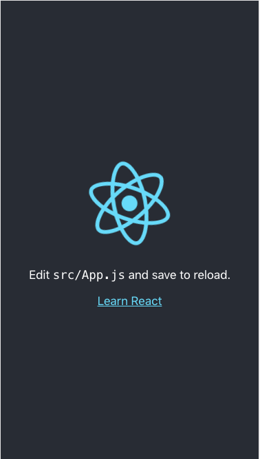
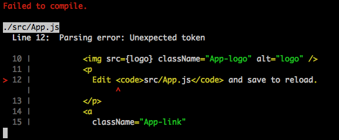
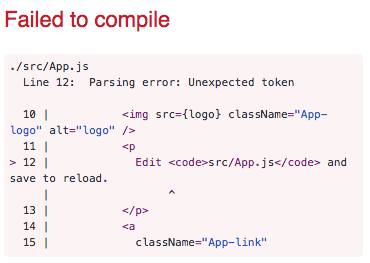
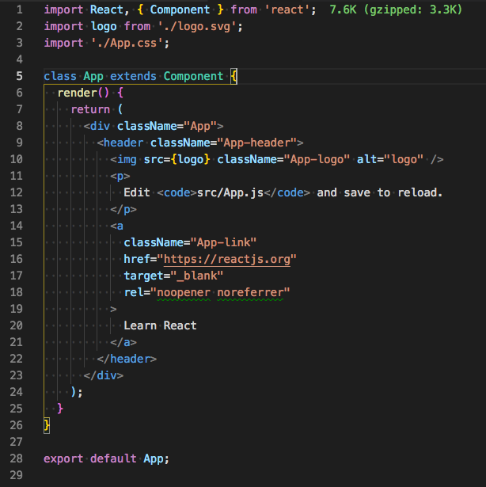
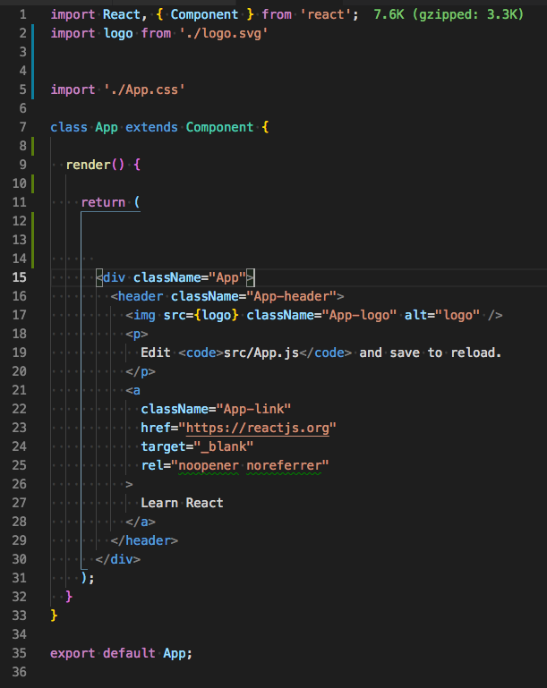
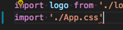
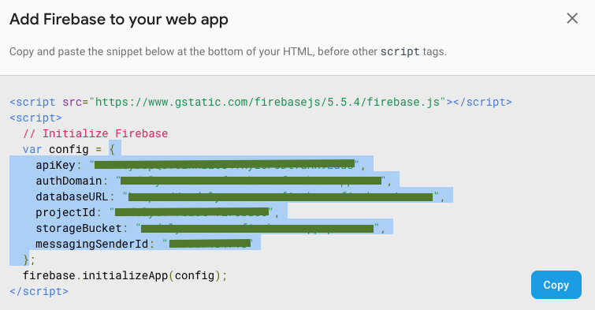

# Unit 1

> **Dependencies**: We need to have installed NodeJS, yarn and create-react-app.

This unit contains the base project structure.

## Steps

### Scaffolding

We have created our project scaffolding using [`create-react-app`](https://github.com/facebook/create-react-app)

```bash
$ npx create-react-app PROJECT_NAME
```

> Note one important fact about this is we can use some ES6 features, like class fields and static properties. See [Supported Language Features and Polyfills](https://github.com/facebook/create-react-app/blob/master/packages/react-scripts/template/README.md#supported-language-features)

Update the `package.json` file with some information about project details (like author, contributors, descriptions, keywords, etc).

At this point we have our scaffolding ready to run with `$ yarn run start`. This will open `localhost:3000` and present the next screen:




> **Why using CRA (create-react-app) ?**
> 
> We do not recommend using CRA in your first react application. It makes tons of things that could seem *magic*.
>
> When working with JS and, mainly for client side, our applications tend to need things like having a lightweight size or reduce the number of calls to server (among many others). To help on that has arisen tools like `webpack`, which given an *entry point* analyzes our dependencies (that is, which other files are imported or required) and creates a unique file (a bundle) doing things like:
>
> - Ensure each file is included only once
> - Minimize/uglify the code to reduce the final size.
> - Inlining CSS code
> - Inlining SVG images
> 
> All that is perfect for production, the issue is while developing additional things, like: continue seeing the original source code or *watch* for file change to *rebundle*.
> 
> So, at this point, is where tools like CRA are useful. Once you know how to make all that things by yourself, the best you can do is DRY.
>
> CRA initializes our project with four npm scripts:
>
> ```json
>   "scripts": {
>     "start": "react-scripts start",
>     "build": "react-scripts build",
>     "test": "react-scripts test",
>     "eject": "react-scripts eject"
>   },
> ```
> 
> - `start`: Runs our project in development mode at `localhost:3000`.
> - `build`: Generates a `build` folder with optimized code for production.
> - `test`: Magic, it runs the tests of our project.
> - `eject`: *Cleans* our project from any dependency on CRA.

### Development dependencies

We encourage you install the next browser extensions while developing, they will help you to better understand what `react` and `redux` are doing under the hood.

- [`react-devtools`](https://github.com/facebook/react-devtools): React browser extension.
- [`redux-devtools-extension`](https://github.com/zalmoxisus/redux-devtools-extension): Redux browse extension to see redux actions.

### Linting

> We have used [Visual Code Editor](https://code.visualstudio.com) with the `eslint` extension installed, which automatically recognizes eslint configuration and lint our code while editing.

CRA uses the [`eslint`](https://eslint.org/) tool to check if our code has errors. Any time CRA *compiles* our code and found an error it will present us in the command line and also in the browser:




CRA linting rules are fine, but we want a bit more strict to encourage all the code follow the same *style*. For example, if you edit the `src/App.js` and updated it like in the next images, you will see CRA do not triggers any error:




Because of this we have configured the project to use the rules defined by AirBnB in [`eslint-config-airbnb`](https://www.npmjs.com/package/eslint-config-airbnb). To install them:

```bash
$ npx install-peerdeps --dev eslint-config-airbnb
```

Once dependencies have been installed we need to create `.eslintrc` file with the next config. This is necessary so our editor lints the source code while developing:
  ```
  {
    "extends": "airbnb"
  }
  ```


> Probably, next time you run `$ yarn run start` it will probably fail due a mix of dependencies about `eslint` package, simply follow the steps the message says:
> 
>   ```
>     1. Delete package-lock.json (not package.json!) and/or yarn.lock in your project folder.
>     2. Delete node_modules in your project folder.
>     3. Remove "eslint" from dependencies and/or devDependencies in the package.json file in your project folder.
>     4. Run npm install or yarn, depending on the package manager you use.
>   ```

Finally, we have added a new script to our `package.json` to lint all our source code at once with `$ yarn run lint`:

```json
  "scripts": {
    ...
    "lint": "eslint ./src",
    ...
  },
```

> NOTE: It is a better idea to a tool like [`husky`](https://www.npmjs.com/package/husky) to automatically force running the linting before apply or push any commit.

### Credentials

Our app will use [Giphy](https://giphy.com) to get funny memes and [Firebase](https://firebase.google.com) as backend service. Becuase of this we need to register and get the need credentials from each one.

Fortunately for us, CRA support `.env` variables. Specifically it will read variables from `.env.local` file when running locally, so we will store on that file the access code and API keys for the previous services. Also, a good point is the `.gitignore` file create by CRA will ignore it by default, so placing credentials in the `.env.local` is perfect for developing locally because we can be sure they will not be published on a git repository.

> As a sample file we have added the `.env.dist` file.

### Firebase credentials

- Go to `https://firebase.google.com` and register as a user. Then go to the console `https://console.firebase.google.com`.
- Create a new project.
- Go to `Authentication` and click in the `Web setup` button.
- Copy the `config` variable:
  
- Convert to JSON string: `JSON.stringigy($CODE_HERE)`.
- Add it to the `.env.local` file under `REACT_APP_FIREBASE_CONFIG` variable.

## Giphy credentials

- Go to `https://firebase.google.com/` and register as a user.
- Create a new app and get the provided API Key.
- Add it to the `.env.local` file under `REACT_APP_GIPHY_API_KEY` variable.

