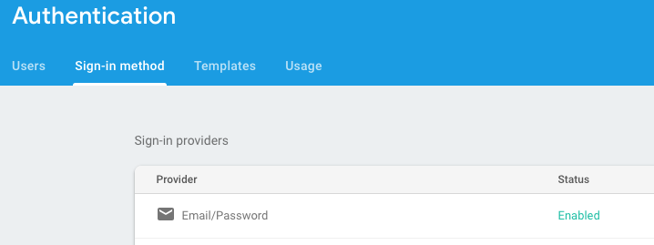

# Unit 4

This units installs Firebase and creates necessary classes to create a user.

> NOTE: Ensure you get Firebase authentication config as explained in *Unit 1*.

## Steps

### Firebase

Lets install firebase client with `$ yarn add firebase`.

Firebase will be our backend service so we are going to create a file `src/services/firebase.js` responsible to initialize firebase client and returns us a ready to use reference.

```javascript
// Import firebase core and only used functionalities
import firebase from 'firebase/app';
import 'firebase/auth';
import 'firebase/database';

const config = JSON.parse(process.env.REACT_APP_FIREBASE_CONFIG);
firebase.initializeApp(config);

export default firebase;
```

> Some things to note on the previous file:
> 
> - We import the code for the firebase core and only those services we are going to use in our app: `auth` and `database`.
> - We store the firebase configuration in the `.env.local` file. We explain that CRA loads that variables when building the bundle. Because `.env` accepts string we need to parse that value into a JS object we pass to firebase.
> - Firebase it is not initialized, that is, it do not know which is the project and permissions associated, until we pas a configuration.


### Activate email signup method

Firebase authentication allows to authenticate user using many different ways: email/password, email link, Google accounts, Twitter, etc. We are going to use only the classical *email with password* form :)

To do so we need to activate it. Go to firebase console and under *Authentication* section chose the *Sign-in method* tab. Then select *Email/Password* and enable it.



### Update the SignupForm to create users

As first (and bad) approach we are going to update the `SignupForm` component to use firebase to register a user when the form is submitted.

Once we have `firebase` initialized, if we invoke invoking the method `firebase.auth()` we will get an instance of [`firebase.auth.Auth`](https://firebase.google.com/docs/reference/js/firebase.auth.Auth). This class has many methods but we will use:

- `createUserWithEmailAndPassword(email, password)`, creates a new user from a supplied email and password,
- `signInWithEmailAndPassword(email, password)`, validates given an email/password and returns a token we can use to make any operation,
- `signOut()`, forget current firebase token, that is, makes a logout,
- `onAuthStateChanged(callback)`, this method is invoked each time the the sign-in state changes. For example, if we make a signin successfully this `callback` will be invoked with the new user credentials. If we make a `signOut` the `callback` will be invoked with a null value.

#### Update `componentDidMount`

First import the previously create `src/service/firebase.js` service into `SignupForm` component: 

```javascript
import firebase from '../services/firebase';
```

Now create a `componentDidMount` method. This will be executed once the component was mounted in the DOM. This is the perfect place to register a callback with `onAuthStateChanged` to know if we have a user credentials or not.

```javascript
  componentDidMount() {
    const auth = firebase.auth();
    auth.onAuthStateChanged((user) => {
      console.log('-> User changed: ', user && user.toJSON());
    });
  }
```

### Update `handleSubmit` to create a new user

We are going to update the `handleSubmit` method to get the form data and create a new user.

```javascript
  handleSubmit = async () => {
    const { username, email, password } = this.state;
    const { onSubmit } = this.props;

    // onSubmit(username, email, password);

    const auth = firebase.auth();
    const userCredential = await auth.createUserWithEmailAndPassword(email, password);
    if (userCredential) {
      const { user } = userCredential;
      console.log('-> User: ', user.toJSON());
    }
  }
```

Note, what `createUserWithEmailAndPassword` returns is an instance of [`firebase.auth.UserCredential`](https://firebase.google.com/docs/reference/js/firebase.auth#.UserCredential), which on its way contains a reference to `user` which is an instance of [`firebase.User`](https://firebase.google.com/docs/reference/js/firebase.User).

If you add some valid data (username, email and password) and submit you will see in the browser console the messages:

```
-> User changed: SOME_VALUE
-> User Credentials: SOME_OTHER_VALUE
```

The first message is due the `callback` executed by the `onAuthStateChanged` method. If we expand the *user* instance passed to the callback we could see:

```javascript
{
  displayName: null,
  email: 'OUR EMAIL',
  emailVerified: false,
  ...
}
```

The `displayName` the username of our user, the problem is `createUserWithEmailAndPassword` do not fill it with a value. To store the username in this field we need to update the user instance once created. We can do it with the [`User.updateProfile()`](https://firebase.google.com/docs/reference/js/firebase.User#updateProfile) method:

```javascript
  handleSubmit = async () => {
    const { username, email, password } = this.state;
    const { onSubmit } = this.props;

    // onSubmit(username, email, password);

    const auth = firebase.auth();
    const userCredential = await auth.createUserWithEmailAndPassword(email, password);
    if (userCredential) {
      const { user } = userCredential;
      await user.updateProfile({ displayName: username });
      console.log('-> User: ', user.toJSON());
    }
  }
```

At this point we know how create a user in Firebase and we have the user data but:

- How can we pass the user instance to the rest of the app?
- How can we separate presentation from the logic required to create a new user?
- What happens if registration fails? we need to show the error message.
