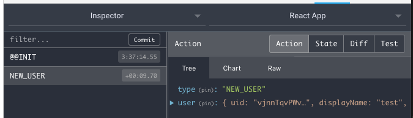

# Unit 5

In this unit we are going to introduce `redux` and `redux-sagas` and show how they can help us to sepparate the business logic from presentation to create more scalable applications.

## Steps

### Container/Presentational pattern

Currently, the current `SignupForm` is responsible to render the form but also to create the user. Let's sepparate this two responsibilities in two different components. To do so we apply the [Presentation/Container](https://medium.com/@dan_abramov/smart-and-dumb-components-7ca2f9a7c7d0) pattern:

- Presentational component: Concern about how things look. We will put our presentational inside `src/components`.
- Container component: Concern about how things work or how to do things. We will put our container components inside inside `src/containers`.

Basically we get the code from `component/SignupForm` and extract the logic on how to create a Firebase user to `container/SignupForm`.

```javascript
/* continer/SignupForm */
class SignupForm extends PureComponent {
  state = {
    user: null,
    fetching: false,
    error: null,
  }

  handleCreateUser = async (username, email, password) => {
    this.setState({ fetching: true });
    try {
      const auth = firebase.auth();
      const userCredential = await auth.createUserWithEmailAndPassword(email, password);
      if (userCredential) {
        const { user } = userCredential;
        await user.updateProfile({ displayName: username });

        this.setState({
          user,
          fetching: false,
        });
      }
    } catch (error) {
      this.setState({
        fetching: false,
        error,
      });
    }
  }

  render() {
    const { user, fetching, error } = this.state;
    const errorMessage = error && error.message;

    // If we are logged redirect to home
    if (user) {
      return <Redirect to={urls.HOME} />;
    }

    return (
      <SignupFormRender
        loading={fetching}
        errorMessage={errorMessage}
        onSubmit={this.handleCreateUser}
      />
    );
  }
}
```

> NOTE: We are using the container's state to hold the state of the form (so, in essence we have not improved anything `:_)`)

  - `fetching` to know if we are registering the new user
  - `error` to store any current error
  - `user` to store the new created user

In addition we are using the `Redirect` component from `react-router` project. This component basically redirects to a new location with it is rendered.

```javascript
if (user) {
  return <Redirect to={urls.HOME} />;
}
```

### Introducing `redux`

Let's start installing `redux`: `$ yarn add redux react-redux`.

Redux implements de Flux arquitecture, which forces one-way bindings making things flow in one direction.

```
+-----------+                                     +------------+
|           |                                     |            |
|  actions  +-----------------------------------> |  reducers  |
|           |                                     |            |
+-----------+                                     +-----+------+
                                                        |
     ^                                                  |
     |                                                  |
     |        +---------+            +---------+        |
     |        |         |            |         |        |
     +------+ |  views  | <--------+ |  store  | <------+
              |         |            |         |
              +---------+            +---------+
```

At this moment our code only has views, with the little improvement of separating the presentation (component) and the logic (container).

Our goal on this unit is:

- Create the store for our app that, for the moment, will only store the signup related data.
- Make the container (the `containers/SignupForm`) listen for changes in our state
- Create action to dispatch information about a new registered user.
- Allow the container to dispatch the previous actions so that some reducers updates the store.
- Create a reducer that updates the store with the data of the new registered user.

#### Create the store

A store is created using the `createStore` method provided by redux. This method requires we pass:

- The initial store values. This is an optional parameters but can be helpful to have some kind of documentation about our store. For example, we can think on our store for the signup as an object like:
  ```javascript
  {
    // Store info related with authentication status and the user profile
    auth: {
      fetching: false, // Indicates if we are trying to register a user
      error: null,     // Error object if any
      user: null,      // The currently logged user
    },
  }
  ```
  So create an `src/initialState.js` exporting the previous object.

- A reducer. Because a state can have many properties we can decompose the reduce step and many *smallest reducers*. In our case we will use a reducer to handle those actions that must update the `auth` property and, in next units, we will need another reducer to manage `sparks` property, so redux needs a *root reducer* which is a combination of reducers.

- Middlewares. We will see in next units. For the moment we have configured the code to use the [redux-devtools](https://github.com/zalmoxisus/redux-devtools-extension) middleware while developing. Follow the instructions to install the browser extension.
  
  This extension is really helpful and allows to see the actions triggered, the changes in our store, etc

With all this we can create our `src/store.js` file:

> NOTE: We will see the `src/rootReducer.js` file next.

```javascript 
/* eslint-disable no-underscore-dangle */
import { createStore, applyMiddleware, compose } from 'redux';

import initialState from './initialState';
import rootReducer from './rootReducer';

// In development, configure middleware for redux devtools
// (see: https://github.com/zalmoxisus/redux-devtools-extension)
const composeEnhancers = process.env.NODE_ENV === 'development'
  ? window.__REDUX_DEVTOOLS_EXTENSION_COMPOSE__
  : compose;

const enhancer = composeEnhancers(
  applyMiddleware(), // Prepare for future middlewares
);

const store = createStore(
  rootReducer,
  initialState,
  enhancer,
);

export default store;
```

#### Listen for store changes

To listen for changes in the state redux offers us the `connect` function. Simply note, `connect` accepts some arguments. Here we are using `mapStateToProps` which is a function that receives the state of the app and returns those properties of interest for the component.

```javascript
import React, { PureComponent } from 'react';
import PropTypes from 'prop-types';
import { connect } from 'react-redux';

...

class SignupForm extends PureComponent {
  ...

  handleCreateUser = async (username, email, password) => {
    const auth = firebase.auth();
    const userCredential = await auth.createUserWithEmailAndPassword(email, password);
    if (userCredential) {
      const { user } = userCredential;
      await user.updateProfile({ displayName: username });
      console.log('-> User: ', user.toJSON());
    }
  }

  render() {
    const { user, fetching, error } = this.props;
    const errorMessage = error && error.message;

    ...

    return (
      <SignupFormRender
        loading={fetching}
        errorMessage={errorMessage}
        onSubmit={this.handleCreateUser}
      />
    );
}

const mapStateToProps = state => ({
  user: state.auth.user,
  fetching: state.auth.fetching,
  error: state.auth.error,
});

export default connect(mapStateToProps)(SignupForm);
```

All the properties you return in `mapStateToProps` well be accessible to the component. For this reason we have changed the `render` method to get `user, fetching, error` from component's properties instead state.

##### *Provide* the redux store to all the react components

All container components need access to the Redux store so they can subscribe to it and listen for changes. The way recommended by redux is to wrap our entire application with the `Provider` component. This component will make use of the react context to make the store accessible to every component.

```javascript
<Provider store={store}>
  <App />
</Provider>
```

So, edit the `src/index.js` import the `Provider` component and wrap it with our previously created store object:

```javascript
...
import { Provider } from 'react-redux';
import store from './store';
import App from './App';

const root = (
  <Provider store={store}>
    <App />
  </Provider>
);

ReactDOM.render(root, document.getElementById('root'));
```

This is how the `connect` method will have access to the store and will be able to *inject* our desired state properties in a component.

#### Create the action

From the redux documentation:

> Actions are payloads of information that send data from your application to your store. They are the only source of information for the store. You send them to the store using `store.dispatch()`.

> Actions are plain JavaScript objects. Actions must have a `type` property that indicates the type of action being performed.

> Other than `type`, the structure of an action object is really up to you.

Actions looks like:

```javascript
{
  type: 'NEW_TODO',
  text: 'Some tasks to do tomorrow'
}
```

> #### A word about ducks
>
> Working with redux could be a bit cumbersome at the beginning, it requires creating actions, reducers, middlewares, etc because of this we are going to organize our code into *ducks*. 
>
> [ducks](https://github.com/erikras/ducks-modular-redux) are simply a proposal for bundling reducers, action types and actions when using Redux.
>
> Note, we are not applying the proposal to extrictly 😅
>
> We are going to organize our ducks by functionality. For example, all the things related with user authentication or registration will be in the `src/ducks/auth` folder.

To avoid creating action object around our code, we are going to create an *action creator*, that is, a function that will create an action object given a set of parameters. To do so create a `src/ducks/auth/actions.js`:

```javascript
export const newUser = user => ({
  type: 'NEW_USER',
  user,
});
```

#### Dispatch action

With our current code, the `src/containers/SignupForm` is can register a new user in Firebase, listen for changes and get properties from redux state, but it lacks of the ability to trigger an action (that could later update the store via a reducer).

To make a container can dispatch an action we can use the `connect` method provided by reduc. In addition to the `mapStateToProps` parameters we can also pass a second one named `mapDispatchToProps`. Because every action should be triggered through the `store.dispatch()` method, the `mapDispatchToProps` function give us access to the `dispatch` reference needed to trigger actions. In addition, like the `mapStateToProps`, all the properties returned will be present as properties within the react component.

Let's update the `src/containers/SignupForm` to allow trigger the `newUser` action we created previously:

```javascript
import { connect } from 'react-redux';
import { newUser } from '../ducks/auth/actions';
...

class SignupForm extends PureComponent {
  ...

  static propTypes = {
    ...
    newUserAction: PropTypes.func.isRequired,
  }

  handleCreateUser = async (username, email, password) => {
    const auth = firebase.auth();
    const userCredential = await auth.createUserWithEmailAndPassword(email, password);
    if (userCredential) {
      const { user } = userCredential;
      await user.updateProfile({ displayName: username });

      const { newUserAction } = this.props;
      newUserAction(user);  // <----- Trigger the action
    }
  }

  render() {
    ...
  }
}

...

const mapDispatchToProps = dispatch => ({
  // 'newUserAction' will become a SignupForm component property
  newUserAction: user => dispatch(newUser(user)), 
});

export default connect(mapStateToProps, mapDispatchToProps)(SignupForm);
```

##### Explore with redux-devtools

Run our app, go to the `http://localhost:3000/signup` and fill the signup form with some data. Now open the browser developer tools on the Redux tab and submit the form content. You should see something like:



You can see how the `NEW_USER` action is triggered and its payload. In addition you can selected the `State` tab and se the value of redux state on each action.

#### Creating the reducer


