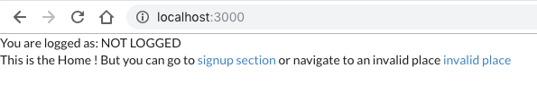

# Unit 7

This unit presents how to manage autologin. Firebase authentication stores state locally to avoid users the need to login each time start a session.

## Steps

### Code changes

From Unit-6 we have made some code changes:

- Extracted actions names as constants in the `ducks/auth/types.js`.
- Renamed `newUser...` actions to `createUser...`.
- Store `Home` as a new container components.
- Moved `App.js` from `src` to `src/containers`.
- Moved logic to create a user from the `ducks/auth/saga.js` to `services/AuthServices.js`.
- Update `components/NotFound.js` to looks better.

### Get current user session

Right now if you refresh the browser, no matter if you just created a new user the home screen of our app will show like this:

Firebase stores authentication state locally. This means when our app starts we need to check if there is any auth state present and recover it, otherwise there is no user and need to allow login or signup.

