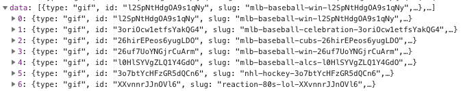
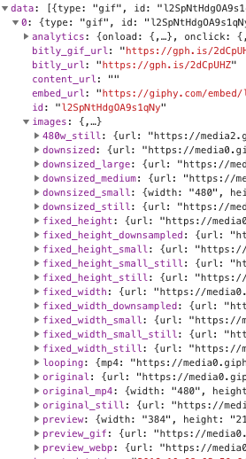
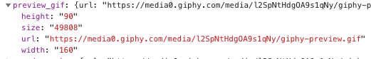
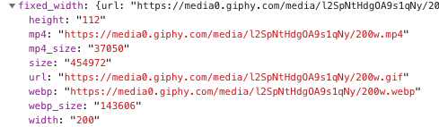

# Unit 8

In this unit we will create the section of the app responsible to add new memes and we will see how to query for memes to the [giphy](https://giphy.com/) service.

## Giphy API

You can find a description of the Giphy API for [search](https://developers.giphy.com/docs/#giphy-sdks) and [image](https://developers.giphy.com/docs/#images-object) response following the links.

A call to giphy search api will return a response with `data`, `pagination` and `meta` properties:



The `data` property contains the list of images that meets the search conditions. Each one contains the information described [here](https://developers.giphy.com/docs/#images-object):



The images object contains many image formats, but we will make use only for `preview_gif` and `fixed_width`. The `preview_gif` info we will used when searching for memes. The url contained in this object points to an optimized and reduced gif images, mainly designed for preview:



We will use the `fixed_width` information to store it in Firebase. The image referenced within this object is what we will use for the app timeline:



## Steps

### Before to start

Note, we start this unit with all the base components of our app created under `src/components` folder. You can see most of them in action running `$ yarn run storybook`.

Remember also to follow the steps described in *Unit 1* to get giphy API key.

### Create the *Add* section

Lets build our *Add* section. The idea is when the user goes to the `/add` url we show the screens necessary to:

- Input a search term, query on giphy service and show results:

[IMAGE]

- Once user selects an image we will show it with an option input to add a title:

[IMAGE]

- Finally if user post the meme we will show a modal for a few seconds indicating the meme is saved in his/her timeline.

[Image]

In the `constainers/Add.js` you will found the skeleton for the container responsible to handle the previous workflow. The problem is, right now, our app doesn't know how to render this container, because of this we need to import the container in the `containers/App.js` and a route:

```javascript
...
import Add from './Add';
...
    // If user is logged in setup the different routes
    return (
      <Router>
        <Switch>
          <Route exact path={urls.HOME} component={Home} />
          <Route exact path={urls.ADD} component={Add} />
          <Route path={urls.LOGIN} component={LoginForm} />
          <Route path={urls.SIGNUP} component={SignupForm} />
          <Route component={NotFound} />
        </Switch>
      </Router>
    );
...
```

Now we can start the *add* process by accessing the url `http://localhost:3000/add`.

> Note, by the fact the `Add` container is added to the `Route` it will receive the properties: `match`, `location` and `history`.

### Create a service to query giphy

Lets create a service responsible to query memes on giphy API. Fortunately for us, giphy offers a JavaScript API :) Install the dependency with `$ yarn add giphy-js-sdk-core`.

Now we are going to create a service that given a search term and an offset makes a search on giphy. Create the `src/services/giphy.js` file:

```javascript
const GphApiClient = require('giphy-js-sdk-core');

const API_KEY = process.env.REACT_APP_GIPHY_API_KEY;

const client = GphApiClient(API_KEY);

const search = async (query, offset) => {
  const response = await client.search('gifs', {
    q: query,
    offset,
  });

  const { data } = response;
  let preview;

  // Sometimes giphy returns images with null values so we use this method
  // to remove invalid results.

  const filtered = data.map((item) => {
    preview = item.images.preview_gif;
    if (preview.url && preview.height && preview.width) {
      return item;
    }
    return null;
  }).filter(item => item);

  response.data = filtered;

  return response;
};

export default {
  search,
};
```

### Query and show memes

Lets update our `containers/Add.js` to use the giphy service to query and show memes to the user.

These are some points to take into account:

- We want to query for memes each time the user changes the term to search. To avoid querying on each key press we use the `debounce` function from `lodash` project.
- Given a term we can make many searches increasing the offset, i.e. when the user scrolls down. In this situation the search term is the same but we need to query for more memes.
- We need to detect when there are no more items to avoid continue making requests to giphy.

```javascript
  queryForImages = debounce(
    async (term = null) => {
      const { data } = this.state;
      const searchTerm = term || this.currentTerm;
      const isNewTerm = searchTerm !== this.currentTerm;

      if (isNewTerm) {
        this.hasMoreData = true;
      }

      if (this.loading || !this.hasMoreData || !searchTerm) {
        return;
      }

      this.loading = true;
      const response = await giphy.search(term, this.offset);
      const responseSize = response.data.length;

      this.setState({
        data: isNewTerm ? response.data : data.concat(response.data),
      }, () => {
        this.currentTerm = searchTerm;
        this.hasMoreData = responseSize > 0;
        this.offset = responseSize > 0 ? response.pagination.offset : 0;
        this.loading = false;
      });
    },
    250,
  ).bind(this);
```

> Note how use `bind` the *debounced* function to have access to `this` context, that is, the class itself.

### Selecting a meme

When an image is clicked the method `handleImageSelected` is invoked. At this point we have the index of the clicked image so it is easy for us to get the current selected.

```javascript
  handleImageSelected = (index) => {
    const { data } = this.state;
    const selectedImageData = data[index];

    this.setState({
      step: 'comment',
      selectedImageData,
    });
  }
```
