# Unit 9

At the end of the previous unit we have been able to search and select an image, so in this unit we will see how to store content into Firebase RealTime Database.

## Firebase RealTime Database

Some points to take into account when working with Firebase RealTime Database:

- It is a NoSQL database
- Data is stores in JSON
- Firebase synchronize content between database and clients in realtime through websockets.
- You need to know how your clients will access your data and structure accordingly.
- You need to define security rules to define who can read/write within the properties tree.

### Working with RealTime Database

You can see RealTime Database as a big JSON object with as many properties you want, where each property can be a string, number, ..., an array or an object. The operation we can do with RealTime Database can be summarized as: reference a node, read, write, update, delete and listen.

#### Writing on RealTime Database

- Get a reference to property `collectionA` that is under database's root:
  ```javascript
  database.ref('collectionA')
  ```
  you can also user:
  ```javascript
  database.ref()
    .child('collectionA')
  ```

- Set a text value on the `collectionA` property:
  ```javascript
  database.ref('collectionA')
    .set('some value')
  ```
  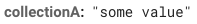

- Set an object value on the `collectionA` property:
  ```javascript
  database.ref('collectionA')
    .set({
      child0: 'this is the child 0',
      child1: 'this is the child 1'
    })
  ```
  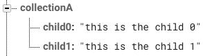

- Change a child value:
  ```javascript
  database.ref('collectionA/child0')
    .set('updated value for child 0')
  ```
  or
  ```javascript
  database.ref('collectionA')
    .child('child0')
    .set('updated value for child 0')
  ```
  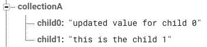

- Add a new child:
  ```javascript
  database.ref('collectionA')
    .child('child2')
    .set('this is the child 2')
  ```
  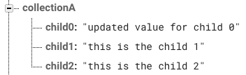

> Note how in previous example we are getting a reference to `child2` before it exists.

- Create a new child with an autogenerated *key*:
  ```javascript
  database.ref('collectionA')
    .push('this is the child with autogenerated key')
  ```
  or in two steps:
  ```javascript
  database.ref('collectionA')
    .push()
    .set('this is the child with autogenerated key')
  ```
  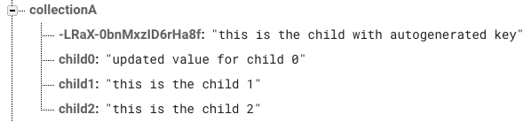

- Create a new child that is an object with some properties:
  ```javascript
  database.ref('collectionA')
    .child('child-object')
    .set({
      id: 'some id',
      description: 'some description',
      values: [0, 1, 2]
    })
  ```
  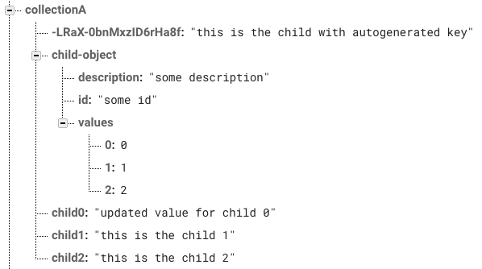

> Note how arrays are stored like *object* where the key is the array index.

#### Reading on RealTime Database

- Read the value of a child:
  ```javascript
  database.ref('collectionA/child1')
    .once('value')
    .then((snapshot) => {
      const value = snapshot.val();
      console.log('-> Value: ', value);
    })
  ```
  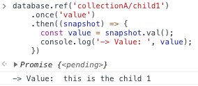

- Read the value of a child's property:
  ```javascript
  database.ref('collectionA/child-object/id')
    .once('value')
    .then((snapshot) => {
      const value = snapshot.val();
      console.log('-> Value: ', value);
    })
  ```
  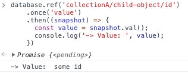

- Read the whole child:
  ```javascript
  database.ref('collectionA/child-object')
    .once('value')
    .then((snapshot) => {
      const value = snapshot.val();
      console.log('-> Value: ', value);
    })
  ```
  

- Read the whole collection:
  ```javascript
  database.ref('collectionA')
    .once('value')
    .then((snapshot) => {
      const value = snapshot.val();
      console.log('-> Value: ', value);
    })
  ```
  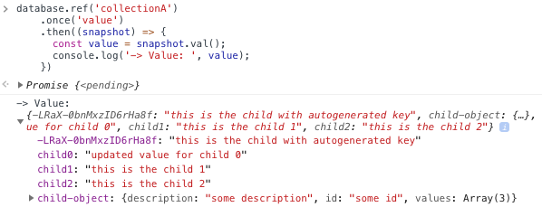

- Reading a not existent path:
  ```javascript
  database.ref('collectionA/not-exists')
    .once('value')
    .then((snapshot) => {
      const value = snapshot.val();
      console.log('-> Value: ', value);
    })
  ```
  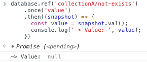

#### Listening for changes

We can attach listeners to properties to be notified when values are added, removed, etc.

- `on`: Creates a listener. This returns a reference to the callback function you need to store to later pass to `off`.
- `off`: Removes the listener.
- `once`: Listens exactly once event. A shorthand for `on`+`off`, so its perfect to read values once.

```javascript
  // Listen for changes in 'collectionA'
  database.ref('collectionB')
    .on('child_added', (snapshot) => {
      const value = snapshot.val();
      console.log('-> New value: ', value);
    })
  
  // Add a new value
  database.ref('collectionB/new-child')
    .set('new child value')
  ```
  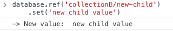

> Take into consideration when you create a listener it will get all the values stored in the node. For example, if we create a listener for `collectionA` we will get the initial content and then will be called for each new child added:

> ```javascript
>   // Listen for changes in 'collectionA'
>   database.ref('collectionA')
>     .on('child_added', (snapshot) => {
>       const value = snapshot.val();
>       console.log('-> New value: ', value);
>     })
> ```
>
> 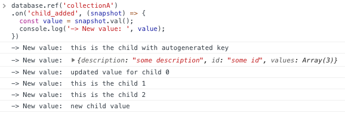

### Structuring data

To design your database structure it is important to take into account next points:

- RealTime Database is a NoSQL database that, at the end, that means denormalized data works better.
- How your clients will access your data and structure accordingly.
- When you read a node in RealTime Database you are retrieving all the content of that node.

Thinking in our app, we want:

- When a user logs in, the home must show a *global* timeline with memes from all users.
- When user goes to his/her profile, he/she must see his/her name and a timeline with his/her owm memes.
- Each meme must show its creation date, author and number of thumbs up (likes) received by other users.

With that requirements in mind our data structure proposal is as follows:

- `users`: We will store the information related to each user within a `users` property using. The key for each user will be the `uid` returned by Firebase Authentication.
  Each user entry will contain: the creation time, the user's display name and a `feed` property where we will store the `id` of each spark (the memes) published by the users.

  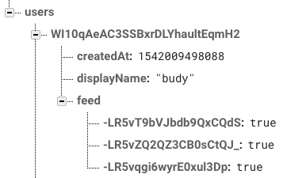

- `sparks`: This will contains the list of memes from all the users. In this case, the key for each spark is generated automatically by Firebase, which ensures it is ordered by the current time. Each meme will store: the creation time, the id to its `author`, a `data` property with some properties related to the giphy image (url, title, size, etc) and the number of likes received.

  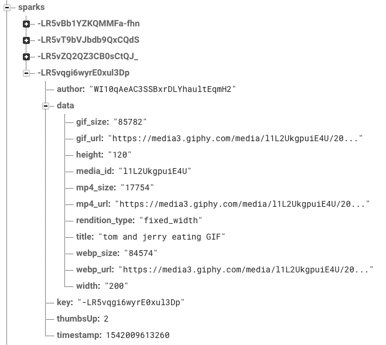

## Steps

### Store user information

Before storing data about a meme we need to store data about the user. To do so, we need to make a little change: each time a users is registered into our app we need to store its data into RealTime Database `users` property.

Lets start creating two things:

- a new service `services/DataService.js` file, that will act as a kind of *repository* and will be responsible to store/retrieve data from/to RealTime Database.
- a new *duck* folder `sparks`, that will store all the code related with actions, sagas and reducers needed to store `users` or `sparks` data.

Create the `DataService.js` file and add the next code:

```javascript
import firebase from './firebase';

const database = firebase.database();

class Service {
  /**
   * Store new user information
   */
  addUser = async (user) => {
    await database.ref(`users/${user.uid}`)
      .set({
        createdAt: firebase.database.ServerValue.TIMESTAMP,
        displayName: user.displayName,
      });
  }
}

export default new Service();
```

> NOTE: The `firebase.database.ServerValue.TIMESTAMP` is a constant that let RealTime Database set the timestamp to the current time.

Now, modify the `ducks/auth/sagas.js` file so that the `creteUser` saga, once created the user in Firebase Authentication, store the user data into Firebase RealTime Database. Just import de `DataService.js` and call the method:

```javascript
...
import DataService from '../../services/DataService';
...
function* createUser(action) {
  yield put(actions.createUserStart());

  try {
    const user = yield call(AuthService.createUser, action.payload);
    yield call(DataService.addUser, user);
    yield put(actions.createUserSuccess(user));
  } catch (error) {
    yield put(actions.createUserFailed(error));
  }
}
...
```

### Store the meme data

If remember the previous unit, we implement the workflow to search and select an image from Giphy service. Now we need to store the data on Firebase RealTime Database.

To achieve this, we need:

1. Add a new `sparks` property to our store.
2. A `postAction` to trigger by the `containers/Add.js`
3. Start a saga from the previous action responsible to store the meme and trigger the corresponding `start`, `success` or `failure` actions.
4. Implement a reducer to listen for the previous events and update the store.

----

#### 1. Adding new `sparks` property to the store

It is easy, we simply need to add it to the `initialState.js` file:

```javascript
export default {
  // Store info related with authentication status and the user profile
  auth: {
    fetching: false,
    error: null,
    user: null,
  },

  // Content
  sparks: {
    fetching: false,  // Indicates if we are loading or posting a meme
    error: null,      // An object with any error produces while posting or loading
    data: [],         // An array with the current sparks loaded by the app
  },
};
```

#### 2. Trigger action to post a meme

Following the ducks *conventions*:

- create a `types.js` file to define the action constants
- create an `actions.js` file that will export the:
  - `postSparkRequest`, this actions will serve to start the saga
  - `postSparkStart`, informs the post process has started
  - `postSparkSuccess`, informs the post process has finished successfully
  - `postSparkFailed`, informs the post process has failed and pass the error.
- create a `selectors.js` file to get the stores's `sparks` properties.

Finally, update the `constainers/Add.js` file and modify the `handleSubmit` method to trigger the `postSparkRequest` action:

```javascript
...
import { postSparkRequest } from '../ducks/data/actions';
import { fetchingSelector, errorSelector } from '../ducks/data/selectors';
...

class Add extends PureComponent {
  ...
  handleSubmit = (title) => {
    const { selectedImageData } = this.state;
    const { postSpark } = this.props;
    const data = {
      ...selectedImageData,
      title,
    };
    postSpark(data);

    this.setState({ step: 'posting' });
  }
  ...
}
```

#### 3. Implement the saga to post a meme

Create the file `ducks/data/sagas.js` and paste the next code:

```javascript
import {
  all, takeLatest, put, call,
} from 'redux-saga/effects';
import AuthService from '../../services/AuthService';
import DataService from '../../services/DataService';
import * as actions from './actions';
import * as types from './types';

function* postSpark(action) {
  yield put(actions.postSparkStart());

  try {
    const { data } = action.payload;
    const imageData = {
      ...data.images.fixed_width,
      title: data.title,
    };

    const user = yield call(AuthService.currentUser);
    yield call(DataService.addSpark, imageData, user.uid);

    yield put(actions.postSparkSuccess());
  } catch (error) {
    yield put(actions.postSparkFailed(error));
  }
}

export default function* () {
  yield all([
    yield takeLatest(types.POST_SPARK_REQUEST, postSpark),
  ]);
}
```

As you can see:

- The main saga is *listening* for `types.POST_SPARK_REQUEST` actions and run the `postSpark` saga.
- The `postSaga` get the current user `uid`, prepares the data about the image to be stores and calls the `DataService`.
- The `postSaga` also triggers `postSparkStart`, `postSparkSuccess` and `postSparkFailed` actions to be listened by the reducer.

Remember to add this new saga to the `rootSaga.js` file so they can be executed:

```javascript
import { all } from 'redux-saga/effects';
import authSagas from './ducks/auth/sagas';
import sparksSagas from './ducks/data/sagas';

export default function* rootSaga() {
  yield all([
    authSagas(),
    sparksSagas(),
  ]);
}
```

The final and most important part :) is to implemente the `DataService.addSpark` method, which is responsible to store the meme in Firebase:

```javascript
  /**
   * Store a new spark
   */
  addSpark = async (data, uid) => {
    const sparkData = {
      author: uid,
      data,
      timestamp: firebase.database.ServerValue.TIMESTAMP,
    };

    // Save spark
    const spark = await database.ref('sparks/')
      .push(sparkData);

    // Store spark key in user's feed
    await database.ref(`users/${uid}/feed/${spark.key}`)
      .set(true);
  }
```

As we explain previously, the meme contains `author` id, the `data` itself and the `timestamp` when the time the meme was inserted. To avoid problems with times (for example, a user can have their device time incrorrectly) we can ensure the creation timestamp is correct letting that responsibility to Firebase using the `firebase.database.ServerValue.TIMESTAMP` constant.

The `addSpark` method will store the spark in the `/sparks` property and also will store a reference in the `/users/uid/feed`. This way user could access easily to the list of memes he/she posted.

#### 4. Implement the reducer to update the store

Now our reducer must listen for the `postSparkStart`, `postSparkSuccess` and `postSparkFailed` actions. We simply need to update the store to indicate we are *sending* a meme to Firebase (with the `fetching` property) or storing any possible error:

```javascript
import * as types from './types';
import initialState from '../../initialState';

const defaultState = initialState.sparks;

export default function (state = defaultState, action) {
  switch (action.type) {
    case types.POST_SPARK_START:
      return {
        ...state,
        fetching: true,
        error: null,
      };

    case types.POST_SPARK_SUCCESS: {
      return {
        ...state,
        fetching: false,
        error: null,
      };
    }

    case types.POST_SPARK_FAILED:
      return {
        ...state,
        fetching: false,
        error: action.payload.error,
      };

    default:
      return state;
  }
}
```

Remember to add the reducer to the `rootReducer.js` file to handle all the reducers on the `sparks` store property:

```javascript
import { combineReducers } from 'redux';
import authReducer from './ducks/auth/reducer';
import sparksReducer from './ducks/data/reducer';

export default combineReducers({
  auth: authReducer,
  sparks: sparksReducer,
});
```
