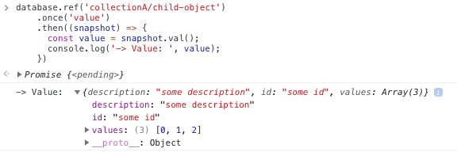

# Unit 9

At the end of the previous unit we have been able to search and select an image, so in this unit we will see how to store content into Firebase RealTime Database.

## Firebase RealTime Database

Some points to take into account when working with Firebase RealTime Database:

- It is a NoSQL database
- Data is stores in JSON
- Firebase synchronize content between database and clients in realtime through websockets.
- You need to know how your clients will access your data and structure accordingly.
- You need to define security rules to define who can read/write within the properties tree.

### Working with RealTime Database

You can see RealTime Database as a big JSON object with as many properties you want, where each property can be a string, number, ..., an array or an object. The operation we can do with RealTime Database can be summarized as: reference a node, read, write, update, delete and listen.

#### Writing on RealTime Database

- Get a reference to property `collectionA` that is under database's root:
  ```javascript
  database.ref('collectionA')
  ```
  you can also user:
  ```javascript
  database.ref()
    .child('collectionA')
  ```

- Set a text value on the `collectionA` property:
  ```javascript
  database.ref('collectionA')
    .set('some value')
  ```
  

- Set an object value on the `collectionA` property:
  ```javascript
  database.ref('collectionA')
    .set({
      child0: 'this is the child 0',
      child1: 'this is the child 1'
    })
  ```
  

- Change a child value:
  ```javascript
  database.ref('collectionA/child0')
    .set('updated value for child 0')
  ```
  or
  ```javascript
  database.ref('collectionA')
    .child('child0')
    .set('updated value for child 0')
  ```
  

- Add a new child:
  ```javascript
  database.ref('collectionA')
    .child('child2')
    .set('this is the child 2')
  ```
  

> Note how in previous example we are getting a reference to `child2` before it exists.

- Create a new child with an autogenerated *key*:
  ```javascript
  database.ref('collectionA')
    .push('this is the child with autogenerated key')
  ```
  or in two steps:
  ```javascript
  database.ref('collectionA')
    .push()
    .set('this is the child with autogenerated key')
  ```
  

- Create a new child that is an object with some properties:
  ```javascript
  database.ref('collectionA')
    .child('child-object')
    .set({
      id: 'some id',
      description: 'some description',
      values: [0, 1, 2]
    })
  ```
  

> Note how arrays are stored like *object* where the key is the array index.

#### Reading on RealTime Database

- Read the value of a child:
  ```javascript
  database.ref('collectionA/child1')
    .once('value')
    .then((snapshot) => {
      const value = snapshot.val();
      console.log('-> Value: ', value);
    })
  ```
  

- Read the value of a child's property:
  ```javascript
  database.ref('collectionA/child-object/id')
    .once('value')
    .then((snapshot) => {
      const value = snapshot.val();
      console.log('-> Value: ', value);
    })
  ```
  

- Read the whole child:
  ```javascript
  database.ref('collectionA/child-object')
    .once('value')
    .then((snapshot) => {
      const value = snapshot.val();
      console.log('-> Value: ', value);
    })
  ```
  

- Read the whole collection:
  ```javascript
  database.ref('collectionA')
    .once('value')
    .then((snapshot) => {
      const value = snapshot.val();
      console.log('-> Value: ', value);
    })
  ```
  

- Reading a not existent path:
  ```javascript
  database.ref('collectionA/not-exists')
    .once('value')
    .then((snapshot) => {
      const value = snapshot.val();
      console.log('-> Value: ', value);
    })
  ```
  

#### Listening for changes

We can attach listeners to properties to be notified when values are added, removed, etc.

- `on`: Creates a listener. This returns a reference to the callback function you need to store to later pass to `off`.
- `off`: Removes the listener.
- `once`: Listens exactly once event. A shorthand for `on`+`off`, so its perfect to read values once.

```javascript
  // Listen for changes in 'collectionA'
  database.ref('collectionB')
    .on('child_added', (snapshot) => {
      const value = snapshot.val();
      console.log('-> New value: ', value);
    })
  
  // Add a new value
  database.ref('collectionB/new-child')
    .set('new child value')
  ```
  

> Take into consideration when you create a listener it will get all the values stored in the node. For example, if we create a listener for `collectionA` we will get the initial content and then will be called for each new child added:

> ```javascript
>   // Listen for changes in 'collectionA'
>   database.ref('collectionA')
>     .on('child_added', (snapshot) => {
>       const value = snapshot.val();
>       console.log('-> New value: ', value);
>     })
> ```
>
> 

### Structuring data

To design your database structure it is important to take into account next points:

- RealTime Database is a NoSQL database that, at the end, that means denormalized data works better.
- How your clients will access your data and structure accordingly.
- When you read a node in RealTime Database you are retrieving all the content of that node.

Thinking in our app, we want:

- When a user logs in, the home must show a *global* timeline with memes from all users.
- When user goes to his/her profile, he/she must see his/her name and a timeline with his/her owm memes.
- Each meme must show its creation date, author and number of thumbs up (likes) received by other users.

With that requirements in mind our data structure proposal is as follows:

- `users`: We will store the information related to each user within a `users` property using. The key for each user will be the `uid` returned by Firebase Authentication.
  Each user entry will contain: the creation time, the user's display name and a `feed` property where we will store the `id` of each spark (the memes) published by the users.

  

- `sparks`: This will contains the list of memes from all the users. In this case, the key for each spark is generated automatically by Firebase, which ensures it is ordered by the current time. Each meme will store: the creation time, the id to its `author`, a `data` property with some properties related to the giphy image (url, title, size, etc) and the number of likes receibed.

  

## Steps

